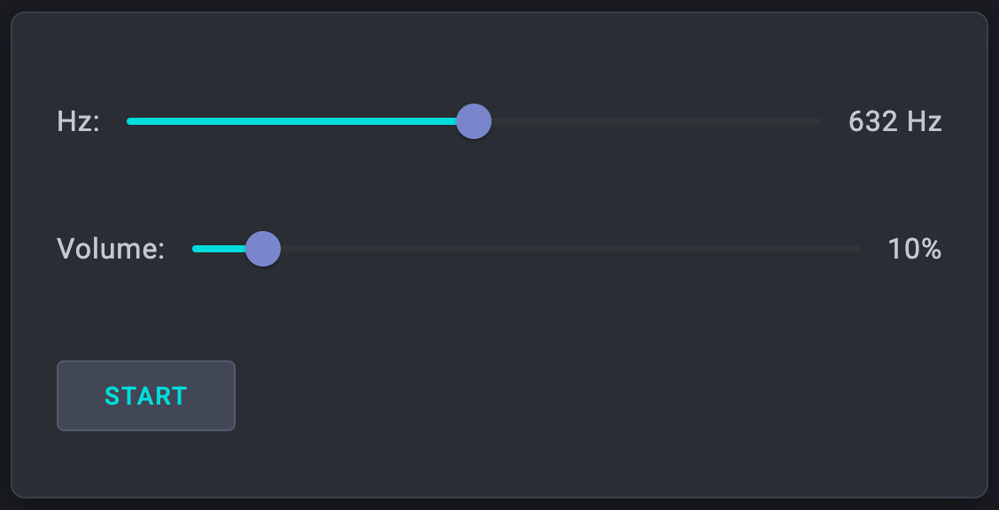

# webaudio-basic

This is a simple web application that demonstrates the use of the [Web
Audio API](https://developer.mozilla.org/en-US/docs/Web/API/Web_Audio_API). It includes a basic user interface for controlling frequency and volume. The
application is built using [Angular](https://angular.dev/).

</a>

You can see a live demo of the application [here](https://webaudio-basic.eminor.net/).

## Local Development

1. Clone the repository.
2. Install the dependencies using `npm install`.
3. Run the application using `npm run start`.
4. Open your browser and navigate to `http://localhost:4200/`.

See the [`package.json`](https://github.com/memestreak/webaudio-basic/blob/main/package.json) file for the list of available development commands.

## Next Steps

Putting on my Product Manager hat, these are obvious next steps:

*    Allow users to create and curate their favorite frequencies.
*    Add a share feature so that users can post their favorite
     frequencies on social media.
*    Integrate with Spotify or other music services to allow creators to publish
     and monitize frequencies.
*    Dog mode